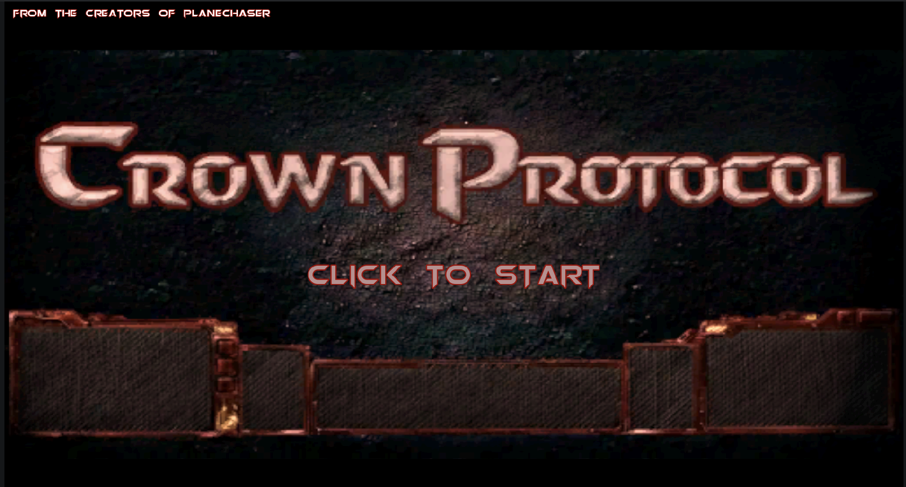

# Overview
Crown Protocol is a fast-paced online multiplayer FPS inspired by the 90's arena shooters such as *Doom*, *Quake*, *Unreal Tournament*, and others.

It was created from the ground up for Florida Poly's Spring 2026 Game Expo utilizing Godot 4.6 and C#.

Checkout our [Itch page!](https://chiefb-radgrant.itch.io/crown-protocol)
